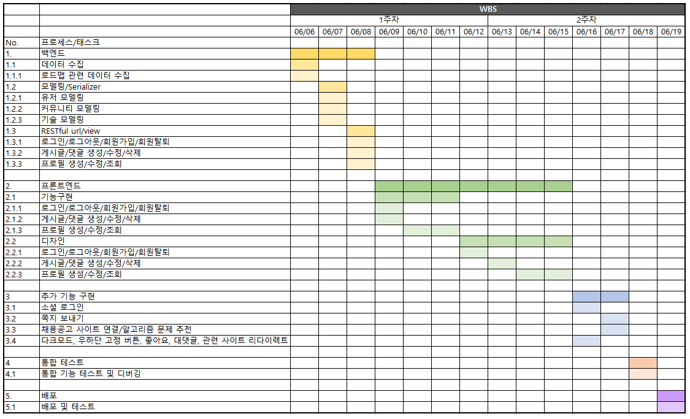
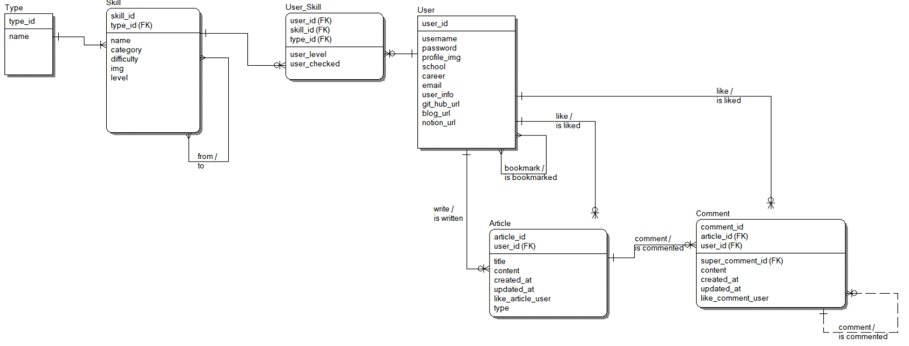
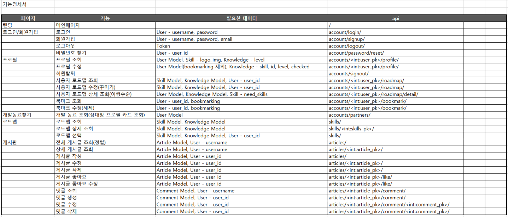
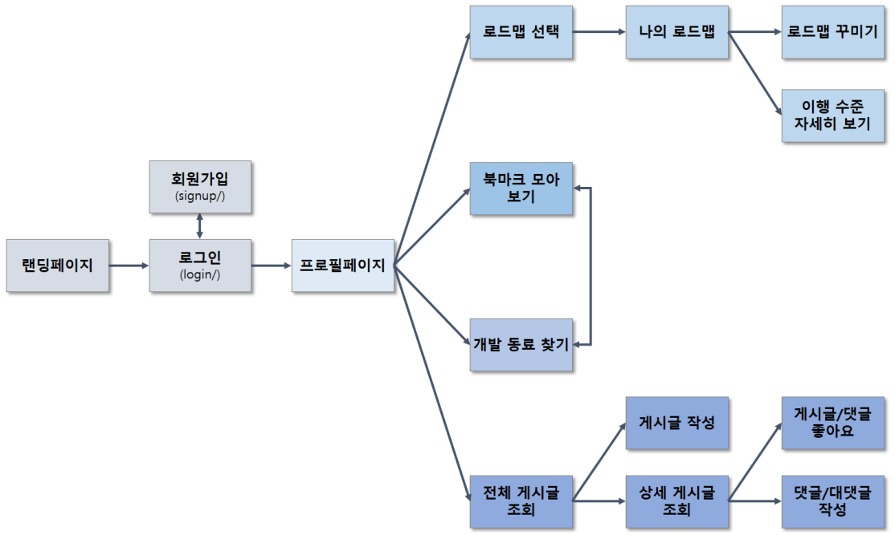

# 개발자 로드맵 웹사이트(가제)

### 🤝팀원

| 이름   | 담당 영역 | Github                        |
| ------ | --------- | ----------------------------- |
| 박시원 |           | https://github.com/siwon-park |
| 이현정 |           | https://github.com/lhynjn9    |

### 📝Description

- 개발자 커리어 정보 제공 프로젝트
- 영화 정보 및 추천 서비스 제공 프로젝트
- 기획의도 : 개발자를 희망하는 취준생들을 위한 커리어 로드맵을 제공하는 프로젝트
  => ~~사용자가 제공하는 정보를 이용했기 때문에 신뢰성있는 정보라고 할 수 있음~~
  => ~~사이트의 서비스를 이용하는 재미를 주기위해 동적으로 웹 페이지를 구성~~

### 🥇GOAL

- 사용자 데이터 기반 ~~동적/반응형~~ 로드맵 제공
  - 다른 사용자의 데이터를 기반으로 한 현재 사용자의 이행 수준 표시

- 취준생들의 개발 정보 공유를 위한 커뮤니티 서비스 구성
- 개발 동료 찾기 기능(카드)
- HTML, CSS, JavaScript, Bootstrap, Vue.js, REST API, Database 등을 활용한 실제 서비스 설계
- SSAFY 7기 배포
  - 피드백 점검
  - 서비스 관리 및 유지 보수

### 🎨 서비스 구현

| No   | 기능                    | 기능 설명                                                    | 추가 기능                                                    |
| ---- | ----------------------- | ------------------------------------------------------------ | ------------------------------------------------------------ |
| 1    | 로그인                  | all auth를 통한 로그인 기능 구현                             | Oauth를 이용한 소셜 로그인                                   |
| 2    | 로그아웃                | all auth를 통한 로그아웃 기능 구현                           |                                                              |
| 3    | 회원가입                | 회원가입 폼 커스텀을 통한 추가 필드 구현                     |                                                              |
| 4    | 회원탈퇴                |                                                              |                                                              |
| 5    | 랜딩 페이지             | 포토샵 : 박시원 3D : 박시원                             |                                                              |
| 6    | 마이페이지(=메인페이지) | 1. 사용자 데이터 기반 동적/반응형 로드맵 제공 2. 사용자 프로필 3. 다른 사용자의 데이터를 기반으로 한 현재 사용자의 이행 수준 표시 4. 로드맵 커스텀 페이지 5. 북마크 모아보기 | 추가 기능 내가 만든 포트폴리오를 기술 스택에 따라 다른사람들이 클릭하여 볼 수 있는 기능 |
| 7    | 개발 동료 찾기          | 1. 사이트 사용자들의 포트폴리오를 카드 형태로 제공(인피니트 스크롤) 2. 검색(search)/정렬(sort)/필터링(filtering) 3. 이메일 주소 제공 4. 북마크 기능 | 이메일 -> 쪽지(인스타, 페이스북 클론 코딩)                   |
| 8    | 로드맵 선택 페이지      | 내가 관심있는 로드맵을 선택할 수 있는 페이지                 |                                                              |
| 9    | 커뮤니티 C.R.U.D        | 게시판 분류 필수 선택                                        |                                                              |
| 10   | 채용 정보 연결          |                                                              | 다른 채용 공고 사이트의 채용 정보를 크롤링 하여 개발자 정보를 가져오기 |
| 11   | 알고리즘 문제 추천      |                                                              | 본인의 수준을 선택하여 알고리즘 문제를 추천받는 기능(크롤링? 뭐?) |
|      |                         |                                                              |                                                              |
|      |                         |                                                              | 다크모드, 우하단 고정 기능, 좋아요 기능, 대댓글 기능, 정보 제공 페이지(알고리즘, 취업관련 페이지) 리다이렉트, |
|      |                         |                                                              |                                                              |

### 🛠Tech Stack

### 📅 WBS

### 🏗 데이터베이스 모델링(ERD)

### 🐾 기능 명세서

### 🏔 컴포넌트 구조

### 🎮 서비스 플로우 차트

### 📜 개발일지

| No.  | Date     | Name   | ToDo                                                         | Done                                                         |
| ---- | -------- | ------ | ------------------------------------------------------------ | ------------------------------------------------------------ |
| 1    | 22/05/20 | 박시원 | 로그인/회원가입 및 기초 CSS                                  | 로그인/회원가입 기능 구현, 영화 데이터 불러오기 구현         |
| 2    | 22/05/20 | 이현정 | 로그인/회원가입, 프로필 데이터 직렬화                        | 로그인/회원가입, 프로필 데이터 직렬화,영화 데이터 필터링     |
| 3    | 22/05/21 | 박시원 | 로그인/회원가입 폼 CSS, 대댓글 기능 구현, 영화 데이터 받아오는 부분 수정 등 | 로그인/회원가입 CSS 폼 작성, 리뷰, 대댓글 기능 구현(일부)    |
| 4    | 22/05/21 | 이현정 | OneVsOne 특정 주제의 응답 수 구현, 패스워드 직렬화 수정, 팔로우 기능 수정, 게시글 직렬화 수정 | OneVsOne 특정 주제의 응답 수 구현, 직렬화 수정, 패스워드 직렬화 수정, 팔로우 기능 수정, 게시글, 직렬화 수정, 유저의 영화 리스트 직렬화 마무리 |
| 5    | 22/05/22 | 박시원 | 대댓글 기능 구현, 프로필 데이터 CRUD 기능 테스트 및 구현     | 대댓글 기능 구현 완료, 프로필 CRUD 데이터 테스트 완료        |
| 6    | 22/05/22 | 이현정 | all-auth url 오버라이팅 테스트, 모델 수정(nickname 필드 삭제), 덤프 데이터 생성 파일 수정 | all-auth url 오버라이팅 테스트, 모델 수정(nickname 필드 삭제), 덤프 데이터 생성 파일 수정, 덤프 데이터 업데이트 |
| 7    | 22/05/23 | 박시원 | 메인 페이지 동작 로직 구성 및 초기 CSS                       | 메인 페이지 데이터 동작 확인 및 구성, 초기 CSS 적용          |
| 8    | 22/05/23 | 이현정 | url 전체 동작 테스트, 데코레이터 추가, 상대방 프로필 조회 url 추가, OneVsOne 주제 등록 url 추가, 친구 추천 기능 수정, 팔로잉 수 출력 | url 전체 동작 테스트, 데코레이터 추가, 상대방 프로필 조회 url 추가, OneVsOne 주제 등록 url 추가, 친구 추천 기능 수정, 팔로잉 수 출력, 평점 기능 수정(사용자 당 1번의 평점 허용) |
| 9    | 22/05/24 | 박시원 | 메인 페이지 작업 마무리, 웹 페이지 동작 버그 개선, 프로필 페이지 필수 구현 기능 구성 | 일부 동작 버그 및 오류 개선 완료                             |
| 10   | 22/05/24 | 이현정 | 영화 추천 알고리즘 구현, 탈퇴 url 생성, 친구 추천 기능 수정(고려 요소에 나이 추가), 장르별 영화 필터링 기능 추가 게시판 필터링 직렬화 생성 | 콘텐츠 기반 영화 추천 알고리즘 구현, 탈퇴 url 생성, 친구 추천 기능 수정(고려 요소에 나이 추가), 장르별 영화 필터링 기능 추가 게시판 필터링 직렬화 생성 |
| 11   | 22/05/25 | 박시원 | 미흡 구현 요소(리뷰 작성 세분화, A vs B 기능 구현, 프로필 페이지, 좋아요/위시리스트 버튼 토글링, 평점 입력 및 수정, 삭제) 등 구현 | 영화를 선택한 리뷰 작성, A vs B 기능 구현, 프로필 페이지 일부 구현 |
| 12   | 22/05/25 | 이현정 | 메인 페이지, 게시글 페이지 css 구성, 추천 알고리즘 수정(고려 요소에 싫어하는 장르 추가), OneVsOne 동작 확인, navbar 커스터 마이징, 로그인/회원가입 폼 수정, 회원 탈퇴 버튼 생성 | 메인 페이지, 게시글 페이지 css 구성, 추천 알고리즘 수정(고려 요소에 싫어하는 장르 추가), OneVsOne 동작 확인, navbar 커스터 마이징, 로그인/회원가입 폼 수정, 회원 탈퇴 버튼 생성 |
| 13   | 22/05/26 | 박시원 | 좋아요/위시리스트 버튼 토글링, 평점 입력 기능 구현, 친구 추천, 팔로우, 리뷰 정렬 기능, 댓글 수정 삭제 권한 정교화 | 버그 수정 및 좋아요/위시리스트 토글링 구현, 평점 입력 기능 구현 |
| 14   | 22/05/26 | 이현정 | 상세 영화 페이지 css 구성, 마우스 오버 효과 수정, 비밀번호 변경 url 테스트 싫어하는 장르 선택 form 생성 | 상세 영화 페이지 css 구성, 마우스 오버 효과 수정, 비밀번호 변경 url 테스트 싫어하는 장르 선택 form 생성 |

### 💎배웠던 점

| Name   | Content                                                      |
| ------ | ------------------------------------------------------------ |
| 박시원 | - 대댓글 구현을 위한 재귀 컴포넌트 작성 - 버튼 태그와 span태그에는 v-model이 적용되지 않는다  - ‘unexpected side effect in ~ computed property 에러’ ⇒ computed로 data를 변경하려 하면 안 된다. - 깃을 활용한 협업 |
| 이현정 | - M:N 관계의 serializer 구성 방법 * 큰 틀의 모델 안에서 정의하려는 데이터 필드를 명확하게 정의해야함 * 여러 행의 데이터를 한번에 가져오기 위해서는 Many=True를 꼭 작성해야하며, 추가적인 수정이 없을 경우 read only 설정을 해주어야 함 - css의 구성 * 태그를 가로 배치하기 위해서는 여러 겹으로 둘러 쌓여져도 하나의 div 태그로 감싸야 함 * 반응형 레이아웃을 구성하기 위해서는 고정된 값보다는 % 로 값을 정하는 것이 필요 - 협업 관리 * git 사용 시, 각 브랜치에서 작업을 하고 마스터 브랜치에서 머지한 후, 새로운 브랜치 이용하는 것이 필요 * 페어와 긴밀한 소통을 통해 작업의 흐름에 맞게 푸시 및 머지 시점을 조율하는 것이 필요 1. 게시글 상세 페이지에서 좋아요 누를 시 화면이 갱신이 되지 않는 문제 발생 2. 게시글 상세 페이지 댓글 작성 시 바로 갱신 되지 않는 문제 발생 3. 게시글 상세 페이지 댓글 삭제 시 바로 갱신 되지 않는 문제 발생 ⇒ 원인은 review와 comment를 computed 속성으로 받아와서 그런 듯함 | 해결완료 |                                                              |
| 2.   | 이현정 | serializer 1. AssertionError: The field 'vote_answer_count' was declared on serializer VoteSerializer, but has not been included in the 'fields' option. => serilaizer에서 정의된 필드가 사용되지 않은 것 2. AssertionError: Expected a `Response`, `HttpResponse` or `HttpStreamingResponse` to be returned from the view, but received a `<class 'NoneType'>` => url에 엔드 슬래시 누락 | 해결완료 |                                                              |
| 3.   | 박시원 | 1. 대댓글 수정 버튼을 누를 시 기존 입력된 데이터를 받아오는 문제⇒ props속성의 데이터이기 때문에 v-model로는 해결 불가 | 해결완료 | 대댓글 생성 후 정상 출력 구현 ⇒ 자기 자신의 id를 자식에게 넘겨줘야하는데 부모의 id를 넘겨주고 있었음 |
| 4.   | 박시원 | 1. 댓글 작성을 완료해도 입력 데이터가 사라지지 않음 2. 대댓글 삭제를 해도 살아있는 현상 발생 3. 대댓글 작성/수정/삭제 권한이 모두에게 보이는 현상 발생 | 해결완료 |                                                              |
| 5.   | 박시원 | 데이터를 가져오고 저장하는 비동기 로직에 대한 이해가 부족, 뷰 라이프 사이클 훅 등 | 미흡     | 추가적인 학습 필요                                           |

### 🤔 느낀점

- #### 박시원

생애 첫 프로젝트를 해본 결과 여러 가지를 깨달을 수 있었습니다. 첫째, 비동기 통신과 vuex에 대해 공부가 좀 더 필요하다고 느꼈습니다. 이론적으로 충분히 이해했다고 생각했던 부분이지만, 실제 백엔드에서 넘어온 데이터를 프론트에서 다루는 과정에서 의도했던 대로 동작하지 않음을 발견할 수 있었습니다. 이를 디버깅하기 위해 많은 시간을 투자했지만 원했던 만큼 완벽하지 않았고 코드를 비효율적으로 짰다고 생각합니다.
둘째, 욕심이 처음에 너무 앞섰던 것 같습니다. 실제 구현할 수 있는 정도를 염두해두고 기본, 필수적인 부분을 먼저 구현했어야 했는데, 추가 구현을 염두해두고 프로젝트를 구성하다 보니 작업 속도도 늦고 여러모로 비효율적이었다고 생각합니다. 셋째, 간단한 로직 같아 보이지만 실제 신경써야할 부분이 꽤나 많다고 느꼈고 권한, 에러 메세지 팝업, 접근 차단 등 생각보다 고려할 점이 많았습니다.
하지만, 이번 관통 프로젝트를 통해 앞으로 주어진 문제에 대해 어떻게 접근해서 해결하는 것이 좋은지에 대해 보다 좋은 경험이 됐다고 생각합니다. 사람들이 왜 프로젝트를 해보는 것이 더 중요하다고 말하는지 조금은 알게 된 시간이었습니다. 무엇을 더 공부해야하고 어디가 부족했으며, 필요로하는 지에 대해 알 수 있게 된 좋은 경험이었습니다.

- #### 이현정

관통 프로젝트를 여러번 진행했지만, 이렇게 큰 규모의 관통은 처음이라 마음이 급했던 것 같습니다. 이전에 여러번 반복적으로 배워서 아는 내용이 많았고, 단지 그것들을 합치는 거였음에도 불구하고 마음이 급해서 차근차근 진행하지 못해서 아쉬움이 남았습니다. 일정을 잘 조율하면 계획한 대로 오류없이 모두 구현할 수 있었지만, 이슈관리의 미흡, 미숙한 협업 등이 원인이 되어 원하는 만큼의 결과를 얻지 못했습니다. 하지만, 이번 프로젝트를 통해 스스로 공식문서를 참고하여 오류를 해결하는 능력을 기를 수 있었습니다. 이전에 중구 난방으로 찾아보던 블로그 글 보다는 공식 문서를 꼼꼼히 확인하는 것이 더 낫다는 것을 깨닫는 경험을 할 수 있었습니다. 이번 프로젝트가 앞으로 진행할 여러 프로젝트의 프로젝트의 양분이 되면 좋겠습니다. 

